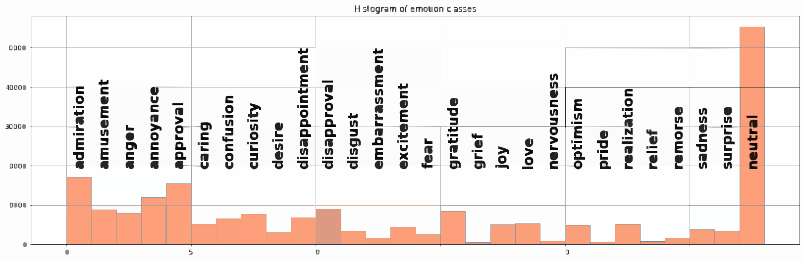
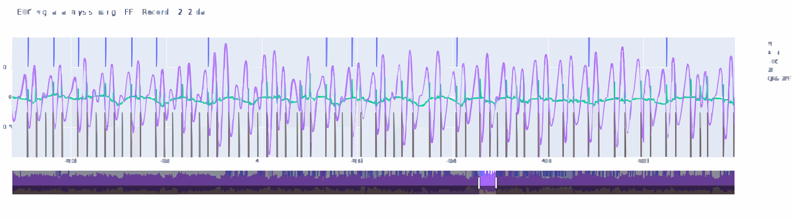

<!-- 

 -->

<!-- 

<table style="width: 100%;">
    <tr>
        <th> </th>
        <th>RaviShankar Prasad</th>
    </tr>
    <tr>
        <td></td>
        <td><ul>
            <li> A <a href="https://scholar.google.ch/citations?hl=en&user=53AIuygAAAAJ" target="_blank"><strong>scientist</strong></a>  in speech, biomedical, and text processing domains</li>
            <li> Built solutions for speech- and text-based analytics, development of conversational AI systems, AI based analytics engines, agentic systems, speech processing, biomedical signal processing </li>
            <li><a href="https://library.iiit.ac.in/Ph.D_ECE_Thesis.html" target="_blank"><strong>PhD in Speech Signal Processing</strong></a> with <a href="https://en.wikipedia.org/wiki/Bayya_Yegnanarayana" target="_blank"><strong>Prof. B. Yegnanarayana</strong></a> </li> from <a href="https://www.iiit.ac.in/" target="_blank"> <strong>IIIT Hyderabad</strong></a>
            <li> Postdoctoral Researcher <a href="https://www.idiap.ch/en/" target="_blank"><strong>Idiap Research Institute</strong></a> (2018-2022)</li>
            <li>Scientist at <a href="https://whispp.com/" target="_blank"><strong>Whispp Inc.</strong></a> (2022-2023)</li>
            <li>Chief Operation Officer at <a href="https://vocab-ai.com/" target="_blank"><strong>Vocab.AI</strong></a> (2023-2026)</li>
            <li>Skills : Machine learning, Deep Learning, Neural Netowrks, Text Processing, Audio Processing, LLMs</li>
            <li>Hobbies : Photography, Fiction, Blues music</li>
        </ul></td>
    </tr>
</table>

 -->

<table style="width: 100%; border-collapse: collapse;">
    <tr>
        <th colspan="2" style="text-align: center; padding-bottom: 20px;">
            <h1>👋 Hello, I'm RaviShankar Prasad</h1>
        </th>
    </tr>
    <tr>
        <td style="vertical-align: top; width: 200px;">
            
        </td>
        <td style="vertical-align: top; padding-left: 20px;">
            

                🚀 <strong>Scientist & Tech Leader</strong> specializing in the intersection of 
                <a href="https://scholar.google.ch/citations?hl=en&user=53AIuygAAAAJ" target="_blank">Speech, Biomedical, and Text Processing</a>.
            

            <ul>
                <li>🧠 <strong>Expertise:</strong> Building end-to-end solutions for Speech/Text Analytics, Agentic Systems, and Conversational AI.</li>
                <li>🎓 <strong>Background:</strong> <a href="https://library.iiit.ac.in/Ph.D_ECE_Thesis.html" target="_blank">PhD in Speech Signal Processing</a> under the guidance of <a href="https://en.wikipedia.org/wiki/Bayya_Yegnanarayana" target="_blank">Prof. B. Yegnanarayana</a> at <a href="https://www.iiit.ac.in/" target="_blank">IIIT Hyderabad</a>.</li>
                <li>🌍 <strong>Journey:</strong> 
                    <ul>
                        <li>🔬 <em>Postdoc:</em> <a href="https://www.idiap.ch/en/" target="_blank">Idiap Research Institute</a> (2018-2022)</li>
                        <li>🔊 <em>Scientist:</em> <a href="https://whispp.com/" target="_blank">Whispp Inc.</a> (2022-2023)</li>
                        <li>💼 <em>COO:</em> <a href="https://vocab-ai.com/" target="_blank">Vocab.AI</a> (2023-2026)</li>
                    </ul>
                </li>
                <li>🛠️ <strong>Tech Stack:</strong> LLMs, Deep Learning, Neural Networks, MLOps, Audio & Text Signal Processing.</li>
                <li>🎨 <strong>Beyond the Code:</strong> Photography enthusiast, fiction reader, and a deep love for Blues music 🎸.</li>
            </ul>
            

                
                
            

        </td>
    </tr>
</table>

<table style="width: 100%; border-collapse: collapse;">
    <tr>
        <th colspan="2" style="text-align: center;">
            <h1>📚 Publications & Research</h1>
        </th>
    </tr>
    <tr>
        <th colspan="2" style="text-align: center; padding-bottom: 20px;">
            Welcome to my research repository! My work primarily focuses on <b>Speech Signal Processing</b>, <b>Acoustics</b>, and <b>Machine Learning</b>, with a specific emphasis on source-system characterization and zero-frequency filtering.
        </th>
    </tr>
    <tr>
        <th colspan="2" style="text-align: center;">
            <h2>🛠️ Research Pillars</h2>
        </th>
    </tr>
    <tr>
        <td style="vertical-align: left; padding-bottom: 20px;">
            

                <li><b>Signal Processing:</b> Zero Frequency Filtering (ZFF), Zero Time Windowing (ZTW), Group Delay Functions.</li>
                <li><b>Speech Science:</b> Glottal activity, Nasalization, Fricative classification, Pitch estimation.</li>
                <li><b>Bio-Signals:</b> Phonocardiogram (PCG) analysis, COVID-19 detection.</li>
                <li><b>Deep Learning:</b> Raw waveform embeddings, Emotion recognition, Supervised Autoencoders.</li>
            

        </td>
    </tr>
    <tr>
        <th colspan="2" style="text-align: center;">
            <h2>🚵‍♂️ Peer-Reviewed Publications</h2>
        </th>
    </tr>
    <tr>
        <th colspan="2" style="text-align: center;">
            <h3><b>🚀 2023</b></h3>
        </th>
    </tr>
    <tr>
        <td style="vertical-align: left; padding-bottom: 20px;">
            
 
                <li>🎤 <b>A Systematic Review on Automatic Speech Recognition for Odia Language.</b> <i>Mishra, N., Dash, S. R., <b>RaviShankar Prasad</b>,Parida, S.</i> In International Conference on Frontiers of Intelligent Computing: Theory and Applications. Singapore: Springer Nature Singapore.<a href="https://link.springer.com/chapter/10.1007/978-981-99-6706-3_9" target="_blank" class="link-icon">[Abstract 🔗 Link]</a></li>
            

        </td>
    </tr>
    <tr>
        <th colspan="2" style="text-align: center;">
            <h3><b>🚀 2022</b></h3>
        </th>
    </tr>
    <tr>
        <td style="vertical-align: left; padding-bottom: 20px;">
            
 
                <li>🎤 <b>Unsupervised Voice Activity Detection by Modeling Source and System Information using Zero Frequency Filtering</b>, <i>Eklavya Sarkar, <b>RaviShankar Prasad</b>, Mathew Magimai Doss</i> <b>Interspeech-2022</b>, Incheon, South Korea.  
                <a href="https://infoscience.epfl.ch/server/api/core/bitstreams/3e1380e2-03aa-4836-aae0-24a5fdc36bde/content" target="_blank" class="link-icon">[Abstract 🔗 Link]</a></li>
                <li>🎤 <b>Modeling of pre–trained neural network embeddings learned from raw waveform for covid–19 infection detection</b>, <i>Zohreh Mostaani, <b>RaviShankar Prasad</b>, Bogdan Vlasenko, Mathew Magimai Doss</i> <b>ICASSP-2022</b>, IEEE, Singapore.
                <a href="https://ieeexplore.ieee.org/stamp/stamp.jsp?arnumber=9746271&casa_token=db6GRo6kaNEAAAAA:OjNT0OAqF1KZO-56tfaCr-VdNarZbMWkQEkA4aFnWW32hNf1utqpHsDjzJbwWjBq0Gy1nxXkELcp&tag=1" target="_blank" class="link-icon">[Abstract 🔗 Link]</a></li> 
            

        </td>
    </tr>
    <tr>
        <th colspan="2" style="text-align: center;">
            <h3><b>🌟 2021</b></h3>
        </th>
    </tr>
    <tr>
        <td style="vertical-align: left; padding-bottom: 20px;">
            
 
                <li>🎤 <i><b>A study of vowel nasalization using instantaneous spectra</b></i>, <b>Computer Speech & Language</b><a href="https://ui.adsabs.harvard.edu/abs/2020arXiv200906416P/abstract" target="_blank" class="link-icon">[Abstract 🔗 Link]</a></li>
                <li>🎤 <i><b>Identification of F1 and F2 in speech using modified zero frequency filtering</b></i>, <b>Interspeech-2021, Brno, Czech Republic</b><a href="https://www.isca-archive.org/interspeech_2021/prasad21_interspeech.pdf" target="_blank" class="link-icon">[Abstract 🔗 Link]</a></li>  
                <li>🎤 <i><b>Fusion of Acoustic and Linguistic Information using Supervised Autoencoder for Improved Emotion Recognition</b></i> <b>MMAC-2021 (Multimodal Sentiment Analysis Challenge)</b><a href="https://dl.acm.org/doi/pdf/10.1145/3475957.3484448" target="_blank" class="link-icon">[Abstract 🔗 Link]</a></li>  
            

        </td>
    </tr>
</table>

<!-- 

<table style="width: 100%; border-collapse: collapse;">
    <tr>
        <th colspan="1" style="text-align: center; padding-bottom: 20px;">
            <h1>📚 Publications & Research</h1>
        </th>
    </tr>
</table>

 -->

<!-- ## 📄 Peer-Reviewed Publications

### 🚀 2023
- 🎤 **A Systematic Review on Automatic Speech Recognition for Odia Language.** *Mishra, N., Dash, S. R., **RaviShankar Prasad**,Parida, S.* (2023, April). In International Conference on Frontiers of Intelligent Computing: Theory and Applications. Singapore: Springer Nature Singapore.
[Abstract/Link](https://scholar.google.ch/citations?view_op=view_citation&hl=en&user=53AIuygAAAAJ&sortby=pubdate&citation_for_view=53AIuygAAAAJ:DJbcl8HfkQkC) 🔗
### 🚀 2022
- 🎤 **Unsupervised Voice Activity Detection by Modeling Source and System Information using Zero Frequency Filtering** *Eklavya Sarkar, **RaviShankar Prasad**, Mathew Magimai Doss* **Interspeech-2022**, Incheon, South Korea.  
  [Abstract/Link](https://infoscience.epfl.ch/server/api/core/bitstreams/3e1380e2-03aa-4836-aae0-24a5fdc36bde/content) 🔗

- 🎤 **Modeling of pre–trained neural network embeddings learned from raw waveform for covid–19 infection detection** *Zohreh Mostaani, **RaviShankar Prasad**, Bogdan Vlasenko, Mathew Magimai Doss* **ICASSP-2022**, IEEE, Singapore.  
  [Abstract/Link](https://ieeexplore.ieee.org/stamp/stamp.jsp?arnumber=9746271&casa_token=db6GRo6kaNEAAAAA:OjNT0OAqF1KZO-56tfaCr-VdNarZbMWkQEkA4aFnWW32hNf1utqpHsDjzJbwWjBq0Gy1nxXkELcp&tag=1) 🔗

### 🌟 2021
- 📰 **A study of vowel nasalization using instantaneous spectra** ***RaviShankar Prasad**, B. Yegnanarayana* **Computer Speech & Language** (Vol 69).  
  [Journal Link](https://ui.adsabs.harvard.edu/abs/2020arXiv200906416P/abstract) 🔗

- 🎤 **Identification of F1 and F2 in speech using modified zero frequency filtering** ***RaviShankar Prasad**, Mathew Magimai Doss* **Interspeech-2021**, Brno, Czech Republic.  
  [Abstract/Link](https://www.isca-archive.org/interspeech_2021/prasad21_interspeech.pdf) 🔗

- 🎤 **Fusion of Acoustic and Linguistic Information using Supervised Autoencoder for Improved Emotion Recognition** *Bogdan Vlasenko, **RaviShankar Prasad**, Mathew Magimai Doss* **MMAC-2021** (Multimodal Sentiment Analysis Challenge).  
  [Abstract/Link](https://dl.acm.org/doi/pdf/10.1145/3475957.3484448) 🔗

### 🔬 2020
- 📰 **Detection of glottal closure instant and glottal open region from speech signals using spectral flatness measure** *Kadiri, S. R., **RaviShankar Prasad**, B. Yegnanarayana* **Speech Communication** (Vol 116).  
  [Journal Link](https://dl.acm.org/doi/abs/10.1016/j.specom.2019.11.004) 🔗

- 🎤 **Detection of S1 And S2 locations in phonocardiogram signals using Zero Frequency Filter** ***RaviShankar Prasad**, Gurkan Yilmaz, Olivier Chetelat, Mathew Magimai Doss* **ICASSP-2020**, IEEE, Barcelona, Spain.  
  [Abstract/Link](https://ieeexplore.ieee.org/abstract/document/9053155) 🔗

- 🎤 **Study of closed phase resonance bandwidths for oral and nasal tracts using Zero Time Windowing** *Abbas, H. D., **RaviShankar Prasad**, Bhanu Teja Nellore, Suryakanth V. Gangashetty* **ICASSP-2020**, IEEE, Barcelona, Spain.  
  [Abstract/Link](https://ieeexplore.ieee.org/abstract/document/9054682) 🔗

### 📈 2018 - 2015
- 🎤 **Discriminating nasals and approximants in English language using zero time windowing** ***RaviShankar Prasad**, S. R. Kadiri, S. V. Gangashetty, B. Yegnanarayana* **Interspeech-2018**, Hyderabad, India.
[Abstract/Link](https://www.isca-archive.org/interspeech_2018/prasad18_interspeech.pdf)🔗
- 🎤 **Identification and classification of fricatives in speech using zero time windowing method** ***RaviShankar Prasad**, B. Yegnanarayana* **Interspeech-2018**, Hyderabad, India.
[Abstract/Link](https://www.isca-archive.org/interspeech_2018/prasad18b_interspeech.pdf)🔗

- 🎤 **Locating burst onsets using SFF envelope and phase information** *Bhanu Teja Nellore, **RaviShankar Prasad**, S. R. Kadiri, S. V. Gangashetty, B. Yegnanarayana* **Interspeech-2017**, Stockholm, Sweden.
[Abstract/Link](https://www.isca-archive.org/interspeech_2017/nellore17_interspeech.pdf)🔗

- 📰 **Determination of glottal open regions by exploiting changes in the vocal tract system characteristics** ***RaviShankar Prasad**, B. Yegnanarayana* **The Journal of Acoustical Society of America** (Vol 140).
[Abstract/Link](https://pubs.aip.org/asa/jasa/article-abstract/140/1/666/604252/Determination-of-glottal-open-regions-by?redirectedFrom=fulltext)🔗

- 🎤 **Robust pitch estimation in noisy speech using ZTW and group delay function** ***RaviShankar Prasad**, B. Yegnanarayana* **Interspeech-2015**, Dresden, Germany.
[Abstract/Link](https://www.isca-archive.org/interspeech_2015/prasad15b_interspeech.pdf)🔗

### 🌱 2013
- 🎤 **Acoustic segmentation of speech using zero time liftering** ***RaviShankar Prasad**, B. Yegnanarayana* **Interspeech-2013**, Lyon, France.
[Abstract/Link](https://www.isca-archive.org/interspeech_2013/prasad13_interspeech.pdf)🔗

---

## 📊 Connect with Me

 --> -->

<!-- --- -->
<!-- *Generated with ❤️ for researchers on GitHub.* -->

<table style="width: 100%;" border="1"  bgcolor="#D6EEEE">
    <tr>
        <th>Recent Projects</th>
        <th>Description </th>
    </tr>
    <tr>
        <td><a href="https://github.com/RSPatQ6IBI/emotion_classification_distilbert_.git" target="_blank"> Emotion Classification using Distilbert Model </a> 
        </td>
        <td><ul>
            <li> 
            

            The project explores the ability of distilbert model to classify emotions in text. Initially, we use the <a href="https://huggingface.co/distilbert/distilbert-base-uncased-finetuned-sst-2-english?text=I+like+you.+I+love+you">default model</a> to predict sentiment, which usually gives classification within positive and negative classes. The code uses the <a href='https://github.com/Lightning-AI/pytorch-lightning'>pytorch lightening</a> library to finetune the model to generate multiclass output. The model is finetuned over the <a href='https://research.google/blog/goemotions-a-dataset-for-fine-grained-emotion-classification/'>Go-Emotions dataset</a>. 
            
            

            </li>
        </ul></td>
        </tr>
    <tr>
        <td> </td>
        <td><ul>
            <li> 
            

            The notebook details methods for scrapping text from webpages and building a chatbot on top of it. The scrapping uses the package <strong>BEAUTIFUL SOUP</strong> 
            
            

            </li>
        </ul></td>
    </tr>
    <tr>
        <td> <a href="https://github.com/RSPatQ6IBI/ECG_analysis_using_ZFF" target="_blank"> R-peak identification in ECG using ZFF </a></td>
        <td><ul>
            <li> 
            

            The project explores possibility of using the zero frequency filtering (ZFF) method for R-peak identification in ECG. The spectral characteristics of temporal discontinuity in a signal are evenly spread across all bands, including very low frequencies such as in the vicinity of 0 Hz. Building upon this understanding, in speech processing zero frequency filtering (ZFF) based approach for detecting impulse-like excitations (instants of significant excitations) has been proposed. The R–peak appears as a discontinuity in the cardiac activity, i.e., the QRS complex in ECG exhibits a transient–like behavior. Furthermore, the QRS complex is a pseudo–periodic phenomena, similar to glottal excitations in voiced speech signal. Motivated by these similarities, we propose an approach to effectively detect R-peak using zero frequency filtering.
            
            

            </li>
        </ul></td>
    </tr>
</table>

<table style="width: 100%;" border="1"  bgcolor="#9be9d0">
    <tr>
        <th>Tutorials</th>
        <th>Description</th>
    </tr>
    <tr>
        <td><a href="https://github.com/RSPatQ6IBI/signal_processing_labs.github.io/blob/main/tutorials_/the_random_forest_tutorial_.ipynb" target="_blank"> Random Forest</a> 
        </td>
        <td><ul>
            <li>Discusses growing a random forest </li>
            <li> Uses scipy and rasterstats </li> 
            <li><a href="https://mlu-explain.github.io/random-forest/"  target="_blank">A cool guide to random forests</a> </li>
        </ul></td>
    </tr>
    <tr>
        <td><a href="https://github.com/RSPatQ6IBI/signal_processing_labs.github.io/blob/main/tutorials_/decision_tree_.ipynb" target="_blank"> Decision Trees </a> 
        </td>
        <td><ul>
            <li> Design decision tree from scratch </li>
            <li> Explains using entropy and information gain as splitting criteria </li>
            <li><a href="https://mlu-explain.github.io/decision-tree/"  target="_blank">A cool guide to decision trees</a> </li>
        </ul></td>
    </tr>
    <tr>
        <td><a href="https://github.com/RSPatQ6IBI/text_processing_exercises_/blob/main/text_handling_NLP_.ipynb" target="_blank"> Text Tokenization and Generating Embeddings  </a> 
        </td>
        <td><ul>
            <li> Explains text tokenization based on different models </li>
            <li> Explains generation of embeddings and methods to index those </li>
        </ul></td>
    </tr>
</table>
